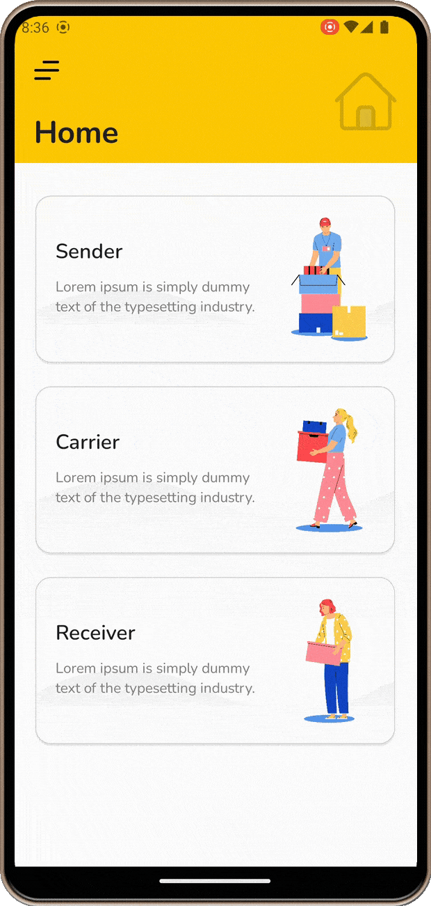
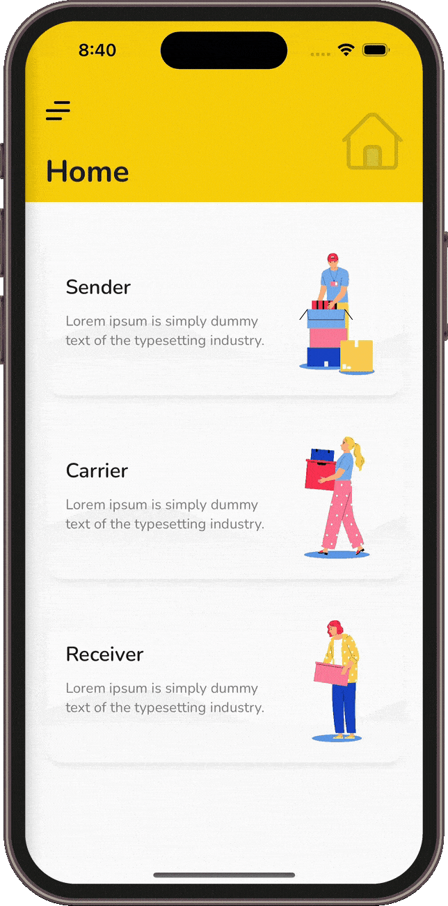

# Hamburger Menu App

**.NET MAUI** implementation of [Hamburger Menu with Landing Card Design](https://dribbble.com/shots/11101126-Hamburger-Menu-with-Landing-Card-Design) by [Sulai Man](https://dribbble.com/sully_man).

https://github.com/RadekVyM/HamburgerMenuApp/assets/65116078/34561e0d-aae3-4342-9896-2522a42eac69

This project demonstrates how to create custom flyout navigation menu using `SimpleShell` control from SimpleToolkit.

## Original design

## Installation

First, make sure you have your Visual Studio and .NET 7 environment set up for .NET MAUI development. If not, follow the [setup instructions](https://learn.microsoft.com/dotnet/maui/get-started/installation). Then make sure you have your [Android](https://learn.microsoft.com/dotnet/maui/get-started/first-app?pivots=devices-android) or [iOS](https://learn.microsoft.com/dotnet/maui/get-started/first-app?pivots=devices-ios) platform set up for deployment of the application.

Once everything is set up, you can clone the repo and run the application via Visual Studio.

Here are some resources to learn more about .NET MAUI:

- [Official website](https://dotnet.microsoft.com/apps/maui)
- [Microsoft Learn](https://learn.microsoft.com/dotnet/maui/what-is-maui)
- [.NET MAUI GitHub repository](https://github.com/dotnet/maui)

## Features

Only .NET MAUI APIs and [SimpleToolkit](https://github.com/RadekVyM/SimpleToolkit) library were used to create this sample.

    
    &nbsp;&nbsp;
    

